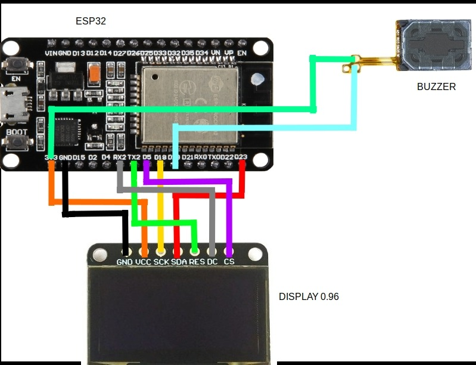

# Git-Watcher

For setup:
1. Assemble your project like the image
  
1. Upload the main.ino file to your arduino IDE
1. The first thing the ESP32 will display is a local IP address
1. Create an URL for ngrok, like so:  
`ngrok http 192.168.0.18:80`

1. Once we have our ngrok URL, we can create a webhook on github

